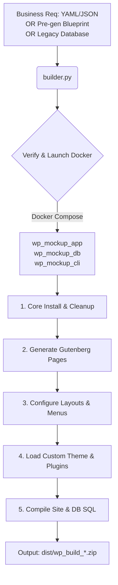

# WordPress AI Custom Site Builder & Packager

A standalone, automated prototyping and compilation pipeline that converts business design audits, content requirements, or pre-generated Gutenberg layout blueprints into a fully customized, local WordPress installation. It also packages the output (database schema, uploads, custom themes, and plugins) into a distributable zip archive in seconds.

This builder is designed to be **agent-agnostic**—it can be driven by Antigravity, Claude Code, Codex, or manually from the terminal.

---

## Architecture & Workflow



---

## Directory Structure

*   `builder.py`: The main build and compile orchestration script.
*   `docker-compose.yml`: Multi-container stack (WordPress, MySQL, WP-CLI).
*   `premium-mockup-styles.php`: A must-use plugin automatically injected to handle dynamic content variables (phone, address, business name) and vertical-specific responsive style classes.
*   `custom-plugins/`: Place custom `.php` files or folders here. They will be copied to the container's plugins directory and activated.
    *   `mu-plugins/`: Place files here to copy them as Must-Use plugins.
*   `custom-theme/`: Place custom WordPress themes (e.g. child themes) here to copy and activate them.
*   `dist/`: Location where packaged sites (`.zip` archives containing database dump + themes + plugins + asset uploads + installation guides) are compiled.

---

## Installation & Prerequisites

1.  **Docker & Docker Compose** must be installed and running.
2.  **Anthropic API Key** (optional, only required if generating homepage copy via Claude AI on-the-fly):
    *   Set via the environment variable `ANTHROPIC_API_KEY`, OR
    *   Create a local `config.yaml` with the following structure:
        ```yaml
        api_keys:
          anthropic: "your-api-key"
        ```

---

## Usage Guide

The builder supports multiple flexible inputs.

### 1. Standalone Mode (Direct CLI Arguments)
You can build a site completely from the command line:
```bash
uv run python builder.py \
  --business-name "Santa Fe Roofing" \
  --phone "(760) 630-9415" \
  --email "santaferoofing@gmail.com" \
  --address "Vista, CA" \
  --rating "4.8" \
  --reviews "44" \
  --categories "Roofing contractor, Gutter service" \
  --vertical "home_services"
```

### 2. Requirements File Mode (YAML or JSON)
Create a file named `requirements.yaml`:
```yaml
business_name: "Santa Fe Roofing & Rain Gutters"
phone: "(760) 630-9415"
email: "santaferoofing@gmail.com"
address: "2244 S. Santa Fe Ave. Suite B-1, Vista, CA 92084"
rating: "4.8"
review_count: 44
categories: "Roofing contractor, Gutter service"
vertical: "home_services"
```
Run the builder:
```bash
uv run python builder.py --requirements requirements.yaml
```

### 3. Pre-Generated Blueprint Mode (Local/Offline Layouts)
If your AI coding agent (like Antigravity or Claude Code) has already written the layout and copywriting Gutenberg blocks locally, you can pass them directly as a `blueprint.json` file. This skips the Anthropic API call:
```json
{
  "tagline": "Top-rated roofing company since 1990",
  "primary_color": "#1e293b",
  "secondary_color": "#ea580c",
  "home_content": "<!-- wp:cover ... -->...<!-- /wp:cover -->"
}
```
Run the builder:
```bash
uv run python builder.py --requirements requirements.yaml --blueprint blueprint.json
```

### 4. Legacy Mode (Main Database Integration)
To hook back into the main project's SQLite lead database:
```bash
uv run python builder.py --lead-id 41 --db ../prospector/prospects.db --config ../prospector/config.yaml
```

---

## Custom App / Plugin Scaffolding

Agentic tools can dynamically construct one-off features, calculators, widgets, or custom integrations for specific businesses.

1.  **Plugin Files**: Write your custom plugin PHP files (e.g. `estimate-calculator.php`) or directories.
2.  **Placement**: Save them to the local `custom-plugins/` directory before building (or use `custom-plugins/mu-plugins/` for auto-activation).
3.  **Compilation**: Run `builder.py`. The builder will automatically copy, secure permissions, and run `wp plugin activate` via WP-CLI inside the container.

---

## Compiling & Exporting (Zipping)

By default, at the end of each build, the compiler runs an export sequence:
1.  Runs `wp db export` to generate a MySQL database SQL dump of pages, menus, options, and layouts.
2.  Copies the database dump, custom themes, custom plugins, and uploaded assets out of the Docker container.
3.  Generates a step-by-step `INSTALL.md` deployment guide.
4.  Compresses everything into a single archive: `dist/wp_build_[business-slug].zip`.

To disable this behaviour, pass the `--no-export` flag.

---

## Accessing the Mockup

*   **Live Site**: [http://localhost:8080](http://localhost:8080)
*   **Admin Dashboard**: [http://localhost:8080/wp-admin](http://localhost:8080/wp-admin)
    *   **Username**: `admin`
    *   **Password**: `adminpassword`
